# 🎓 NLP Mini-Project Defense & Q&A Prep Guide

> [!IMPORTANT]
> **Presentation Date & Time:** May 20, 2026 at **10:45 AM** (Local Time: ~10 hours from now)  
> **Format:** **10 minutes** presentation (slides) + **5 minutes** Q&A / Defense.  
> **Group Members:** Benhammadi Lokmane & Khedim Youcef (Speciality: IASD, Group 1).

---

## 🌟 PART 1: Addressing Your Three Critical Concerns

### 1. The Model Can Generate C++ Code (Off-Scope Generation) — Is it fine?
**Yes, it is completely fine!** In fact, it is an inherent property of Large Language Models (LLMs) called **generalization capability** and **knowledge retention**.

Here is how you explain and defend this to the professor:
- **The Academic Explanation:** Gemma 4 E2B-IT is a 2.3-billion parameter model that was pre-trained on massive open-web corpora (including code repositories like GitHub) and then instruction-tuned. When we perform Parameter-Efficient Fine-Tuning (QLoRA) on children's stories, we *do not want* to wipe out its base knowledge. Doing so would cause **catastrophic forgetting**, destroying its deep linguistic understanding, grammar, and reasoning capabilities, which would actually make its stories *worse* and less coherent.
- **Our API-Level Guardrail Implementation (Active Prototype):**
  We have actually implemented a prompt-level system guardrail inside our FastAPI backend (`build_prompt` in `api/app.py`) for our instruction-tuned Gemma models. The prompt wraps user input with a strict instruction: *"You are a children's story assistant. Reject any coding, technical query, or any other request that is not related to generating children stories. If the user asks for code, technical explanations, or non-story content, politely refuse..."*
- **Presenter's Tip:** During the live demo, you can show this guardrail in action! If you ask the Gemma model to write a C++ program, it will politely decline. If the professor asks why GPT-2 models do not have it, explain: *"GPT-2 is a basic autoregressive model without instruction-following tuning. Prepending a complex system instruction would only confuse its generation output. For advanced models like Gemma, prompt-level system instructions are highly effective."*

---

### 2. Lack of BLEU & ROUGE Scores — Is it fine?
**Yes! In fact, you should proudly explain why BLEU and ROUGE are NOT suitable for creative generation tasks like story writing!** 

Here is your bulletproof scientific defense:
- **The Core Argument:** BLEU and ROUGE are **n-gram overlap metrics**. They were designed for **Machine Translation** (where there is a direct, literal source sentence) and **Summarization** (where the output is constrained by a source text). They measure how many exact words are shared between the generated text and a single *reference ground-truth text*.
- **The "Creative Bottleneck" in Storytelling:** In creative story generation, there is **no single ground truth**. If the prompt is *"a dragon afraid of fire"*, there are millions of beautiful, unique, grammatically perfect stories that could be written. If a model generates a brilliant, highly creative story that uses different adjectives or sentence structures than the reference story, **BLEU would score it a 0.0**. Conversely, a model that generates a bad, repetitive story but repeats key words from the reference would get a higher BLEU score.
- **What You Did Instead (The Better Way):** You evaluated the model using **Readability Metrics** (Flesch Reading Ease and Flesch-Kincaid Grade Level) using the `textstat` library.
  - Since your project aims for **Age-Conditioned generation** (Age 3-4 up to Age 11-12), the core hypothesis is that stories generated for 3-year-olds must have simpler vocabulary and shorter sentences than stories for 11-year-olds.
  - By using Flesch-Kincaid, you **directly evaluated the target variable of your project** (linguistic complexity across age groups). Your results show that the grade level naturally scales up as the target age increases (e.g., Grade ~4.5 for Age 3-4 vs Grade ~6.5 for older cohorts). This is a highly sound, publication-grade evaluation methodology!

---

### 3. "I don't feel ready for tomorrow's presentation"
Don't panic. A 10-minute presentation is extremely fast. You only have time to present about **6 to 8 slides**. If you and Lokmane spend too much time on code, you will run out of time. Focus on **the pipeline architecture, the training constraints you overcame (VRAM limits), the edge-deployment (GGUF), and a short, beautiful live demo.**

---

## ⏱️ PART 2: The 10-Minute Slide Budget & Presenter Flow

Split the presentation clean down the middle with **Lokmane** to show seamless teamwork.

```mermaid
gantt
    title 10-Minute Presentation Timeline
    dateFormat  m
    axisFormat %M
    section Lokmane
    Intro & Problem Statement   : 0, 2
    Model Architectures         : 2, 4
    section Youcef
    Dataset & Formatting        : 4, 5
    Training & VRAM Tricks      : 5, 7
    Quantization & Deployment   : 7, 8
    Results & Web UI Demo       : 8, 10
```

### Slides Breakdown

#### 👤 presenter 1: Lokmane (Minutes 0 - 4)
*   **Slide 1: Title & Group Presentation (0:00 - 0:30)**
    *   *Script:* "Good morning, Professor. Today, we are presenting our NLP project: an end-to-end pipeline and web application for **Age-Conditioned Children's Story Generation** using fine-tuned LLMs."
*   **Slide 2: Introduction & Problem Statement (0:30 - 2:00)**
    *   *Key Focus:* Why is this hard? Base LLMs are generalists. If you ask them to write a story for a 3-year-old, they might use complex words like "juxtaposition". We need **domain adaptation** and **style adaptation** while keeping it memory-efficient to run locally.
*   **Slide 3: Model Selection & Comparison (2:00 - 4:00)**
    *   *Key Focus:* We compare a high-capacity model (**Gemma 4 E2B-IT**, 2.3B parameters) and a lightweight model (**GPT-2 Small**, 124M parameters). Explain what the "E" in **E2B** stands for (**Effective parameters** via **Per-Layer Embeddings**) and why it's optimized for edge hardware. We also compare with base models (`gpt2-xl` and `gemma-4-E4B-it`) to show the necessity of fine-tuning.

#### 👤 presenter 2: Youcef (Minutes 4 - 10)
*   **Slide 4: Dataset & Conditioning Format (4:00 - 5:00)**
    *   *Key Focus:* We used the Hugging Face `Children-Stories-Collection` (~900K rows, subsampled to 10K for efficiency). We prepended age-level prefixes to the prompt (e.g. `Level: Age3-4 — Simple words.`) inside Gemma's native chat template to teach the model to associate prefix indicators with specific sentence complexities.
*   **Slide 5: Training & VRAM Optimization (5:00 - 7:00)**
    *   *Key Focus:* Training a 2.3B parameter model on consumer/cloud hardware (Kaggle dual T4 GPUs) has massive memory limitations, especially with Gemma 4's massive **256,000-token vocabulary** which causes VRAM spikes during cross-entropy loss calculation.
    *   *How we beat it:* QLoRA (frozen base loaded in 4-bit, training only lightweight LoRA adapter adapters), a batch size of 1 with 16 gradient accumulation steps, and gradient checkpointing.
*   **Slide 6: Quantization & Edge Deployment (7:00 - 8:00)**
    *   *Key Focus:* LoRA adapters were merged into the FP16 base. To run this efficiently on consumer CPU/RAM without requiring an expensive GPU, we converted the merged model to GGUF format via `llama.cpp` and quantized it to `Q4_K_M` (4-bit). This reduced disk space to ~1.5 GB.
*   **Slide 7: Results, Evaluation & Web UI Demo (8:00 - 10:00)**
    *   *Key Focus:* Show the FastAPI and HTML5/JS web app. Highlight the premium, highly responsive **Dark Mode toggle** (which supports system preference matching and local-storage persistence for a premium user experience). Demonstrate the model generating a story for Age 3-4 (very short, basic vocabulary) and Age 11-12 (more narrative complexity) using the *same prompt theme*. Highlight the Flesch-Kincaid evaluation showing successful age conditioning.

---

## 🙋‍♂️ PART 3: Top 10 Anticipated Defense Questions & Answers

If you study these 10 questions, you will easily survive the 5-minute Q&A session!

### Q1: Why did you choose Google's Gemma 4 E2B-IT instead of a larger model like Llama-3-8B?
> **Answer:** "First, edge hardware constraints. An 8-billion parameter model loaded in FP16 requires 16GB of VRAM just to load, making fine-tuning on a standard 16GB GPU impossible without heavy quantization. Second, **Gemma 4 E2B** is an architectural marvel. It uses **Per-Layer Embeddings (PLE)** and alternating attention mechanisms to deliver the capability of a larger model with only 2.3 billion active parameters. Quantized to `Q4_K_M`, it runs extremely fast on a consumer CPU, which is exactly what we wanted for local deployment."

### Q2: What is the difference between QLoRA and normal LoRA?
> **Answer:** "In standard LoRA, the base model weights are kept frozen in 16-bit (FP16 or BF16) format, and we train 16-bit low-rank adapters. In **QLoRA**, the base model weights are quantized down to a highly efficient **4-bit NormalFloat (NF4)** format. Double quantization and paged optimizers are used to manage VRAM. This allows us to train a 2.3B parameter model with a VRAM footprint of under 8 GB during the backward pass."

### Q3: Why didn't you use BLEU or ROUGE metrics to evaluate the stories?
> **Answer:** "BLEU and ROUGE are n-gram overlap metrics designed for translation and summarization, where a rigid semantic reference exists. In creative text generation like children's storytelling, a model can generate an exceptionally engaging and grammatically perfect story that has zero exact n-gram overlap with a single reference text. BLEU would score this 0.0. To assess our core goal—**age conditioning**—we evaluated our generations using **Flesch-Kincaid Grade Level and Readability scores** via the `textstat` library. This measured whether our model successfully simplified sentence structures and vocabulary for younger brackets and enriched them for older brackets, which is a much more appropriate semantic evaluation."

### Q4: How does the model know how to change its style based on the age group?
> **Answer:** "During dataset preparation, we prepended custom control prefixes to the prompt (e.g. `Level: Age3-4 — Simple words.`, `Level: Age11-12 — Richer vocabulary.`). During fine-tuning, the model learns the statistical association between these specific prefixes and the structural complexity of the subsequent stories in the dataset. At inference time, by supplying the prefix corresponding to the user's selected age group, we steer the model's token probabilities toward simpler or richer sentence lengths and vocabulary."

### Q5: What is the vocabulary size of Gemma 4 E2B, and why did it present a training challenge?
> **Answer:** "Gemma 4 has a massive vocabulary of **256,000 tokens** (compared to GPT-2's 50,257 tokens). While a larger vocabulary makes the model highly expressive and multimodal, it creates a significant memory bottleneck during training. The final output projection layer (LM Head) must calculate logits over all 256K dimensions. In PyTorch, computing cross-entropy loss over large sequences with a 256K vocabulary causes VRAM spikes. We overcame this by using a batch size of 1 with gradient accumulation, paged 8-bit AdamW, and disabling evaluations during the training loop to prevent Out-Of-Memory (OOM) crashes."

### Q6: Your model occasionally generates text outside of children's stories (like C++ code) if prompted. How did you handle this?
> **Answer:** "We implemented an active, prompt-level system guardrail inside our FastAPI backend (`api/app.py`). When a user queries a Gemma model, the API wraps the prompt with strict system instructions, instructing the model to reject any coding, technical, or off-topic queries and politely redirect the user back to storytelling. This is highly effective for instruction-tuned models like Gemma E2B-IT. For a production deployment, we would further reinforce this with a dedicated input validation classifier (like Meta's Llama Guard or NVIDIA's NeMo Guardrails) at the API gateway level. We excluded GPT-2 from this prompt-level guardrail because it lacks instruction-following capabilities."

### Q7: Why did you convert the model to GGUF format instead of serving it as a standard PyTorch model?
> **Answer:** "Standard PyTorch model execution requires a heavy Python runtime environment, full PyTorch installations, and significant VRAM/GPU resources. **GGUF** is a highly optimized binary format designed for edge execution using `llama.cpp` (written in pure C/C++). It supports rapid, memory-mapped loading, and excels at running quantized models directly on CPU RAM using hardware-specific accelerations (like AVX2, neon, or metal). This makes deployment lightweight, cheap, and accessible for machines without dedicated GPUs."

### Q8: What quantization type did you choose for GGUF, and why?
> **Answer:** "We chose **`Q4_K_M`** (4-bit, Type K, Medium quantization). This format quantizes the weights to 4-bit precision but uses higher-bit precision (like 5-bit or 6-bit) for critical attention layers (like `attention.wv` and `feed_forward`). This provides the perfect sweet spot: it drastically reduces the file size to ~1.5 GB while keeping the **perplexity loss** (degradation in generation quality) extremely low compared to the unquantized FP16 model."

### Q9: Why did you use GPT-2 Small as a comparative baseline?
> **Answer:** "GPT-2 Small (124M parameters) represents a classic, lightweight, autoregressive architecture. Since it is small, we fully fine-tuned all its parameters. Comparing our fine-tuned Gemma 4 E2B-IT (2.3B parameters, QLoRA) against GPT-2 Small allowed us to evaluate the impact of **parameter scaling** and instruction-tuning. The results proved that Gemma's larger capacity and instruction-tuned base yielded vastly superior narrative structures, vocabulary adaptation, and logical coherence."

### Q10: If you had more time and resources, what would be the next steps to improve this project?
> **Answer:** "We would focus on three areas:
> 1. **Retrieval-Augmented Generation (RAG):** To ground the educational aspects of our stories in real-world facts and eliminate factual hallucinations.
> 2. **Reinforcement Learning from AI Feedback (RLAIF):** To further align the stories with child-safety guidelines.
> 3. **Image Generation Pipeline:** Integrating a lightweight edge text-to-image model (like Stable Diffusion XS) in the frontend to generate real-time illustrations for the stories as they stream."

### Q11: How did you ensure that generated stories end nicely instead of cutting off abruptly in the middle of a sentence when they hit the token limit?
> **Answer:** "Instead of relying on a hard token cutoff, we implemented **prompt-level length pacing constraints** inside our API (`api/app.py`). By translating the requested token count to an approximate word count (e.g. 1 token ≈ 0.75 words) and injecting length-planning instructions directly into Gemma's prompt (e.g., *'Please pace the story carefully so that the entire narrative is fully complete... and concludes entirely within a maximum of approximately X tokens...'*), we leverage the instruction-following capabilities of Gemma. The model dynamically plans its story layout, delivering highly satisfying, complete resolutions before hitting the maximum token limit."

### Q12: Why did you simplify the prompt format specifically for the GPT-2 baseline model, and what was the impact?
> **Answer:** "GPT-2 Small (124M parameters) is a standard pre-trained autoregressive model that lacks modern instruction-following fine-tuning. When we prepended long, complex instruction prompts (e.g. *'Write a clear children's story for X readers about Y... Use complete sentences...'*), the model's small attention mechanism was overwhelmed by the instruction tokens, leading to nonsensical and repetitive generation loops. To fix this, we implemented **Prompt Simplification and Clean Prefix Adaptation** inside the API. We stripped common redundant prefixes (like *'write a story about a '*) and fed a concise prefix: `Level: AgeX-Y\nStory about {article} {clean_theme}:\n`. This allowed GPT-2 to immediately focus its attention on the theme, producing beautifully coherent, highly relevant, and grammatically perfect stories."

---

## 📝 PART 4: Project Technical Cheat Sheet

Keep these core statistics memorized or written down on a note card during the presentation!

| Concept | Gemma-4-E2B-IT (Fine-Tuned) | GPT-2 Small (Baseline Fine-Tuned) |
| :--- | :--- | :--- |
| **Parameters** | 2.3 Billion (Dense) | 124 Million |
| **Vocab Size** | 256,000 | 50,257 |
| **Hardware Used** | Kaggle Dual NVIDIA T4 (16GB VRAM each) | Kaggle CPU/T4 GPU |
| **Fine-Tuning Method** | QLoRA (4-bit NF4 Base, Rank=16, Alpha=32) | Full Fine-Tuning |
| **Dataset Subsample** | 10,000 stories | 50,000 stories |
| **Train/Val Split** | 95% Train / 5% Validation | 95% Train / 5% Validation |
| **Deployment Format** | GGUF (`Q4_K_M` 4-bit Quantization) | Standard PyTorch / Hugging Face weights |
| **Quantized Size** | **~1.5 GB** | ~500 MB |
| **Primary Evaluation** | Flesch-Kincaid Grade Level & Readability | Flesch-Kincaid Grade Level & Readability |

---

## 💪 You are ready!
Your report is exceptionally well-written, your technical choices (QLoRA, Gemma-4-E2B-IT, GGUF edge quantization via llama.cpp, React/FastAPI local service) are highly professional and modern, and your defense arguments are solid. 

Go to sleep, get some rest, and crush your presentation tomorrow! Good luck! 🚀
